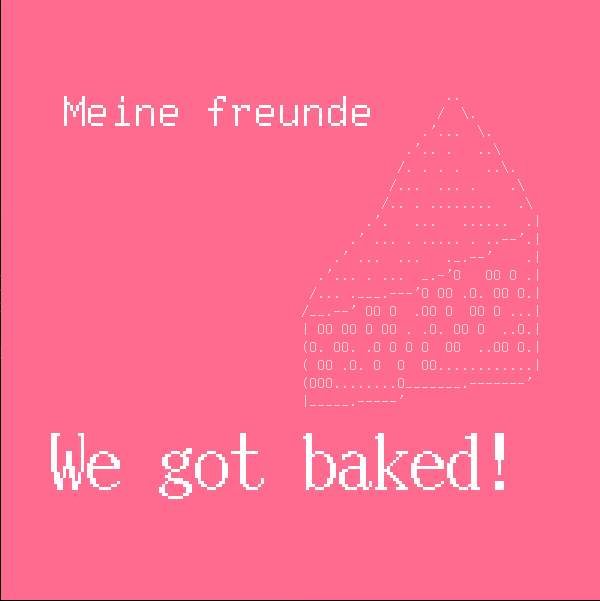

# Font baking example in Odin and Raylib

_Let's become independent from directories around us._



To get font codepoints I used `otfinfo` from the `lcdf-typetools`.

```sh
otfinfo -u ttyp016-uni.ttf
```

Resources to explore codepoints:

- https://codepoints.net/
- https://en.wikipedia.org/wiki/List_of_Unicode_characters

The cake was taken from https://asciiart.website/art/4895
